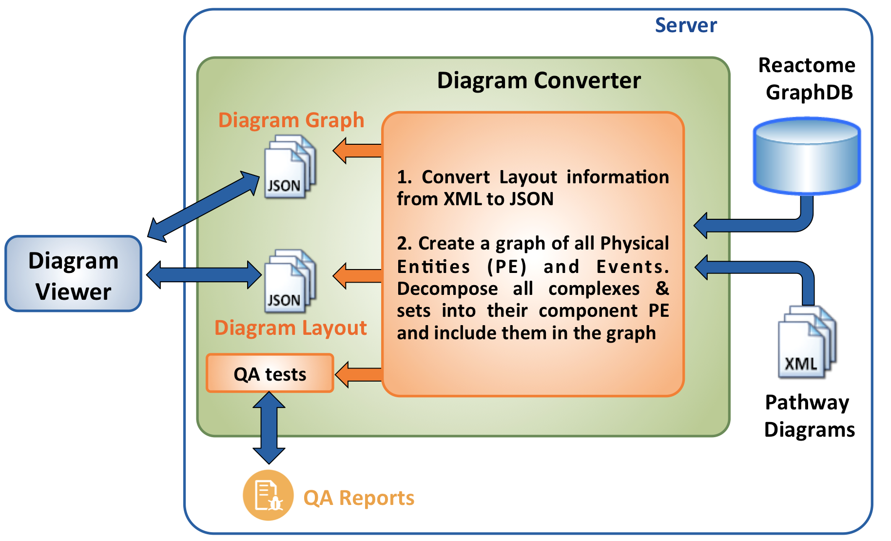

[](https://reactome.org)

# Diagram-Converter
#### What is the Diagram Converter?
The Diagram-Converter contains a collection of server-side tools, mainly focusing on the generation of a set of 
JSON files to be consumed by the Pathway Diagram Viewer v3.0. As illustrated in the following figure, 
the Diagram-Converter relies on the XML diagram files and the GraphDB to generate two different types of files for every single pathway diagram. 
The first file includes layout information necessary to render a diagram (nodes, edges, coordinates, glyphs, names, shades, etc.), 
while the second file includes a graph of the pathway diagram and all its contained entities. Additionally, the converter performs a 
series of quality assurance (QA) checks to ensure the consistency of our pathway diagrams. 

It should be noted that this conversion takes place during our data release, typically on a quarterly basis.

To learn more about the techniques and methods we use to boost the rendering of our diagrams, you can have a look at our most recent [publication](https://doi.org/10.1093/bioinformatics/btx752). 



#### How do I generate all pathway diagrams ?
** Maven Setup: https://maven.apache.org/guides/getting-started/maven-in-five-minutes.html.

1. Clone the Diagram-Converter repository on your end
    ```console
    git clone https://github.com/reactome-pwp/diagram-converter.git
    ```
 
2. Navigate into diagram-converter

3. Package with Maven 
    ```console
    mvn clean package
    ```
  
4. Diagram-core Help: --help 
    ```console
    java -jar target/diagram-converter-jar-with-dependencies.jar --help  
    ```

5. Convert all pathway diagrams (ensure special characters are escaped)

        ```console
        java -jar target/diagram-converter-jar-with-dependencies.jar
             -a graph_db_host
             -b graph_db_port
             -c graph_db_user
             -d graph_db_password
             
             -e rel_db_host
             -f rel_db_name
             -g rel_db_user
             -h rel_db_password
              
             -o output_folder
             [-r list_of_trivial_molecules]
             
             [--verbose] 
        ```

    Please note that the current list of trivial molecules can be found in [./src/main/resources/trivialchemicals.txt](./src/main/resources/trivialchemicals.txt)

#### How do I generate specific pathway diagrams ?
The user can also specify a target list of diagrams to be generated by using the -t switch and the list of DBIDs (e.g. -t:5654738,5655291,2219530,5637815) 

##### Important
In case of connection to a remote server via ssh there might be a "No X11 DISPLAY variable was set" error. Then try unsetting the DISPLAY using the following command:

  ```console
  unset DISPLAY
  ```
